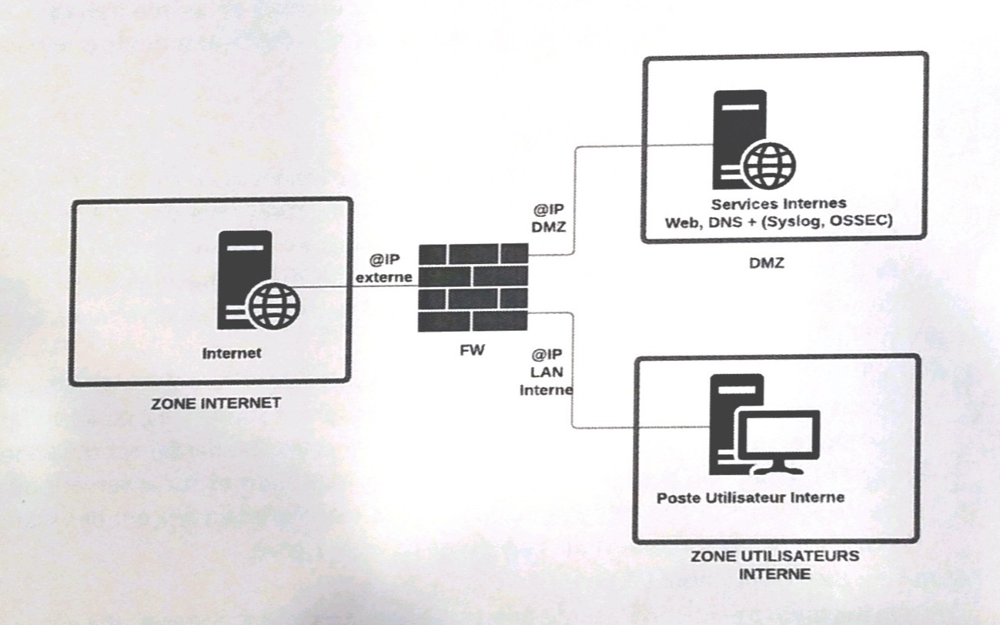
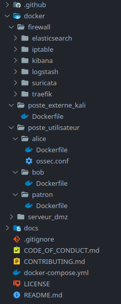
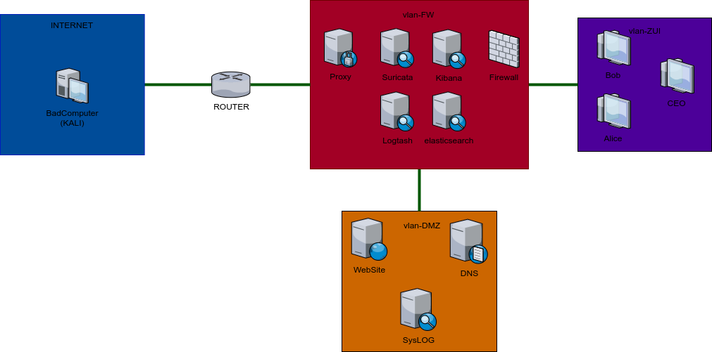
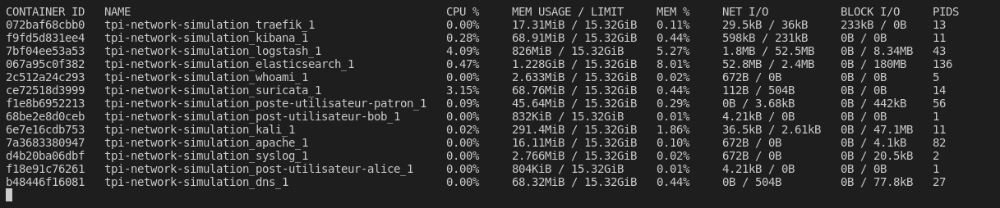
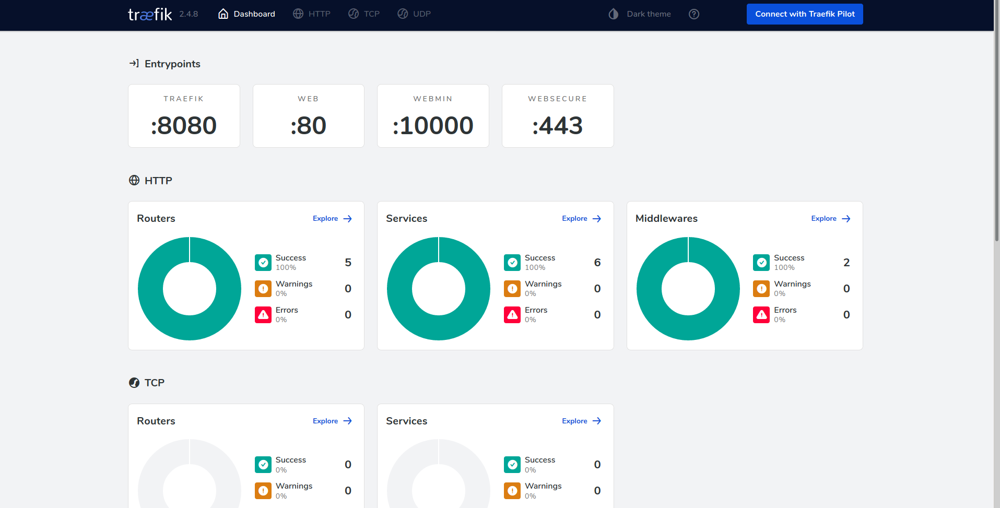
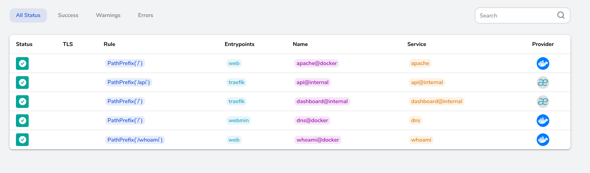
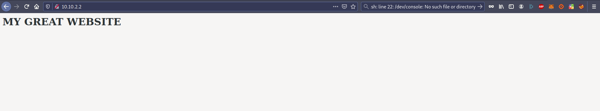
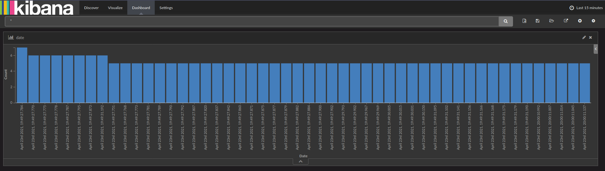

# Introduction

L'objectif de ce projet est de concevoir une simulation dans laquelle nous allons tenter de déclencher une intrusion puis de la détecter en remontant l'alerte.

Pour arriver à cet objectif nous allons donc devoir :

-   créer un ensemble de machines virtuelles connectées entre elles
-   créer un firewall permettant de filtrer les requêtes
-   créer un serveur en DMZ qui sera notre "point sensible"
-   créer un attaquant, une machine virtuelle externe, qui tentera de pénétrer le réseau

Ce rapport décrit notre procédure et les évolutions du projet au fur et à mesure de nos avancées ainsi que de nos recherches.

{ width=80%}

# Technologie de virtualisation

La toute première réflexion que nous avons était le choix de la technologie permettant de faire tourner nos multiples machines virtuelles. Le sujet nous proposant un minimum de 4 machines, il nous paraissait difficile de toutes les faire tourner sous **VirtualBox** ou **VMware** en raison des limites de matériel à notre disposition, en effet nous travaillons majoritairement sur PC portable et nous sommes limités par la quantité de RAM et de puissance de calcul.

Un autre type de virtualisation existe cependant : la "**containérisation**". Le principe ? Au lieu d'émuler une machine complète, on n'**émule que la partie applicative**, ainsi le noyau de la machine est utilisé pour les appels courants cependant les machines sont isolées du système et les unes des autres dans des conteneurs. Ainsi nous pouvons faire tourner un plus grand nombre de ces machines virtuelles avec le même matériel.

La technologie que nous avons décidé d'utiliser est [Docker](https://www.docker.com/).

{ width=60%}

L'outil [docker-compose](https://docs.docker.com/compose/) va nous permettre de **décrire les réseaux** ainsi que les interactions entre chaque image composant ce projet.

Ainsi nous allons **décrire chaque machine**, les configurer, créer des réseaux virtuels et attribuer chaque machine à ces réseaux, mettre en place un pare-feu et ainsi de suite.

Nous avons donc la structure de fichier suivante : 

{ width=20%}

Chaque dossier dans le dossier `docker` représente une machine sur le réseau. Dans chacun de ces dossier on va retrouver un fichier `Dockerfile` contenant la configuration de base de la machine avec par exemple les fichiers a copier dans le conteneur. Une telle configuration ressemble au fichier suivant : 

```dockerfile
FROM atomicorp/ossec-docker

# copy config
COPY ossec.conf /var/ossec/etc/ossec.conf

# restart ossec
RUN ["/var/ossec/bin/syscheck_update", "-a"]
RUN ["/var/ossec/bin/syscheck_update", "-l"]
RUN ["/var/ossec/bin/ossec-control", "restart"]
```

On se base sur une image préexistante sur [Docker Hub](https://hub.docker.com/), puis on peut y copier des fichiers, exécuter des commandes et ainsi de suite. Ces commandes seront exécutées lors du build de l’image du conteneur. Nous travaillerons alors avec cette image fraîche pour le reste du projet.


# Création des sous-réseaux

Nous venons de voir comment nous allions créer chaque machine. Maintenant nous devons nous poser la question de **comment organiser** ces machines en réseau afin de pouvoir commencer à configurer ces dernières et à simuler les intrusions.

Pour commencer avec la configuration de docker-compose, nous avions mis **toutes les machines sur le même réseau**, en exposant les ports nécessaires. Cela fonctionnait mais était bien loin de ce que l’on peut retrouver en entreprise ou simplement dans un réseau réel.

Nous avons découvert que docker-compose permet de créer **un lien DNS** direct vers chaque machine du réseau afin de pouvoir y accéder simplement par son nom. Imaginons maintenant que l’image docker de mon pare-feu s’appelle `firewall`, pour y accéder depuis n’importe quelle machine présente sur le réseau, nous n’avons pas besoin de connaître son identité, il suffira d’y accéder par : `http://firewall/` ce qui est pratique.

Nous avons donc réfléchis à la manière d’organiser ce réseau de machines. Le plus simple était de commencer par la machine externe au système. On suppose quelle se trouve sur internet donc elle est mise dans son propre sous-réseau que l’on va appeler `Internet`.

Ensuite avant d’accéder à l’ensemble des machines sur le réseau, les requêtes devront passer par un router, c’est donc le nœud suivant. Ensuite nous avons un sous-réseau pour le pare-feu comprenant différents services tels que Logstash, Suricata, Kibana ou encore Elasticsearch. Dans notre simulation, chacun de ces services tournera sur sa propre machine. Il s’agira du sous-réseau `vlan-FW`. 

On continue avec l’espace DMZ contenant le site web, le serveur DNS et syslog pour remonter les logs par Logstash. Ce sous-réseau sera nommé `vlan-DMZ`. 

Enfin nous avons l’espace utilisateur avec les postes utilisateur des employés de l’entreprise: Alice, Bob et le CEO. Ce sous-réseau portera le nom de `vlan-ZUI`. 

Voici le schéma récapitulatif de ce que nous allons essayer d’implémenter pour ce projet. On distingue bien les différents sous-réseaux présents.



En utilisant docker-compose cette configuration se faire de façon relativement simple : 

```yaml
version: "3.1"
services:
    ## service name, NOT the name of the container (that gets assigned automatically)
    ## === ZUI ===
    poste-utilisateur-CEO:
        ## image from which the conatiner should be built, equals to FROM in Dockerfile
        build: ./docker/poste_utilisateur/ceo/
        tty: true
        stdin_open: true
        ## restart on crash
        restart: always
        # ports to expose
        ports:
            # host:container
            - "2221:22"
        networks:
        	# the virtual lan used for this service
            vlan-zui:
                ipv4_address: 10.10.3.2
    ## === INTERNET ===
    kali:
        build: ./docker/poste_externe_kali/
        tty: true
        stdin_open: true
        restart: always
        ports:
            - "2222:22"
        networks:
            # another sub-network
            internet:
                ipv4_address: 10.10.0.2
```

Maintenant que les sous-réseaux sont crées, il suffit d’aller dans le répertoire principal du projet et de taper les commandes suivantes : 

```bash
sudo systemctl start docker.service
docker-compose build
docker-compose up
```

En tapant ensuite la commande `docker ps ` on peut voir l’ensemble des conteneurs qui tournent sur la machine. Avec `docker stats` on peut suivre la consommation des ressources de l’ensemble des machines du réseau :



Ce qui est bien moindre en comparaison avec des machines virtuelles sous VirtualBox ou VMware.

# Mise en place des machines factices

Nous avons utilisé [Traefik](https://doc.traefik.io/traefik/) comme router qui nous permet notamment d’avoir une belle interface graphique : 

{width=80%}

Ainsi que de configurer les routes accessibles depuis l’extérieur :



Nous avons par la même occasion créer un serveur web hébergeant une page toute simple : 

{width=90%}

# Création du Firewall

Le sujet nous proposait de nous tourner vers pfSense, une solution de pare-feu open source. Cependant, nous avons essayé de lancer un conteneur Docker tournant avec une image de pfSense et ce sans succès. Nous avons alors cherché d’autres produits permettant d’atteindre les mêmes objectifs, c’est à dire d’avoir un pare-feu open-source et gratuit à notre disposition pour filtrer les requêtes et remonter tous les évènements à un serveur de collecte.

Nous allons définir les règles de filtrage pour configurer le firewall. Étant sous un système UNIX nous allons utiliser `iptable` pour définir les règles de filtrage de base. Voici à quoi ressemble le fichier de configuration :

```ruby
*filter

# INIT
:INPUT DROP [0:0]
:FORWARD ACCEPT [0:0]
:OUTPUT ACCEPT [44:6020]

# Basic input rules
-A INPUT -m state --state RELATED,ESTABLISHED -j ACCEPT
-A INPUT -p icmp -j ACCEPT
-A INPUT -i lo -m comment --comment "Loopback interface" -j ACCEPT

# Specific rules WEB
-A INPUT -p tcp -m tcp --dport 80 -j ACCEPT
-A INPUT -p tcp -m tcp --dport 443 -j ACCEPT

# Default REJECT LINE
-A INPUT -j LOG --log-prefix DROPPED_INGRESS-

COMMIT
```

Par défaut on a décidé de bloquer tout le trafic entrant. On fonctionne alors sur le principe de la whitelist, c’est à dire que seul un ensemble de ports explicités seront autorisés à entrer. Pour l’instant sur le trafic sortant on autorise tous les ports entre 44 et 6020.

Tout d’abord on autorise tous les ordinateurs. C’est à dire que l’on autorise tous les ordinateurs à communiquer avec le réseau. On accepte le protocole ICMP donc les pings venant de l’extérieur. Enfin on active le “Loopback interface” sur le firewall.

Ensuite nous avons autorisé le trafic web en ouvrant les ports 80 et 443 correspondant aux protocoles HTTP et HTTPS afin de pouvoir accéder au serveur web.

Pour terminer on autorise les logs a transiter sur le réseau. La dernière ligne permet d’enregistrer les règles sur le firewall.

# Utilisation de Syslog-ng pour les logs FW et Serveur

-> logs centralisés via le protocole syslog, serveur de collecte sous syslog-ng

# Mise en place de la défense réseau avec Suricata

-> Activer la fonction IDS, préciser les interfaces surveillées, quels sont les avantages inconvénients, utilisation jeu de règle standard, envoie des alertes sur serveur de collecte, tester depuis zone internet avec scan nmap

# Mécanisme de défense hôte avec OSSEC

-> configuration des fonctions principales: vérification d'intégrité, détection de rootkit, collecte de logs...

# Affichage des logs avec Kibana

Pour l’affichage des logs et leur recherche en filtrant les logs qui ne sont pas intéressant nous avons la possibilité d’utiliser elasticsearch ou Kibana. Nous avons décidé de rester sur Kibana qui était une solution plus légère. Avec Logstash en tant que middleware, le résultat sera le même.

Ainsi avec une configuration de base (à comprendre par défaut) nous pouvons déjà récupérer quelques logs de test et afficher le nombre d’évènement reçus sur le dashboard :



# Attaque avec Metasploit

En utilisant une image Kali linux avec le framework Metasploit, plusieurs outils sont disponibles afin de tester les capteurs que nous avons installé.

**Pour tester le firewall** nous pouvons utiliser l’outil `nmap` avec par exemple la commande suivante qui permet de scanner l’ensemble des ports ouverts entre 1 et 10 000 en cherchant à identifier les protocoles ouverts ainsi que leurs vulnérabilités :

```bash
nmap -sV --script=vulners -v 10.0.0.XX
```

Ainsi du côté de la Kali linux sur internet nous ne trouvons que les ports 80 et 443 d’accessibles sans aucune vulnérabilité (par le script vulners) : 

```
Starting Nmap 7.80 ( https://nmap.org ) at 2020-05-07 17:28 CEST
NSE: Loaded 46 scripts for scanning.
NSE: Script Pre-scanning.
Initiating NSE at 17:28
Completed NSE at 17:28, 0.00s elapsed
Initiating NSE at 17:28
Completed NSE at 17:28, 0.00s elapsed
Initiating Ping Scan at 17:28
Scanning 10.0.0.XX [4 ports]
Completed Ping Scan at 17:28, 0.19s elapsed (1 total hosts)
Initiating Parallel DNS resolution of 1 host. at 17:28
Completed Parallel DNS resolution of 1 host. at 17:28, 2.17s elapsed
Initiating SYN Stealth Scan at 17:28
Scanning 10.0.0.XX [1000 ports]
Discovered open port 80/tcp on 10.0.0.XX
Discovered open port 443/tcp on 10.0.0.XX
Completed SYN Stealth Scan at 17:28, 5.58s elapsed (1000 total ports)
Initiating Service scan at 17:28
Scanning 16 services on x.x.x.x
Service scan Timing: About 56.25% done; ETC: 17:30 (0:00:44 remaining)                                                              
Completed Service scan at 17:30, 84.04s elapsed (16 services on 1 host)
NSE: Script scanning x.x.x.x.
Initiating NSE at 17:30
Completed NSE at 17:30, 6.91s elapsed
Initiating NSE at 17:30
Completed NSE at 17:30, 1.55s elapsed
Nmap scan report for x.x.x.x
Host is up (0.19s latency).
Not shown: 984 closed ports
PORT      STATE SERVICE            VERSION
80/tcp    open  http               Apache httpd 2.x.xx (OpenSSL/1.0.2d PHP/5.6.20)
Service detection performed. Please report any incorrect results at https://nmap.org/submit/ .
Nmap done: 1 IP address (1 host up) scanned in 100.83 seconds
           Raw packets sent: 1022 (44.944KB) | Rcvd: 1001 (40.108KB)
```

**Pour tester le fonctionnement de suricata** en tant que sonde réseau, on peut essayer d’ouvrir un reverse shell depuis l’une des machines vers la Kali Linux. Ainsi ce trafic devrait être récupéré et loggé par suricata. Avec une bonne configuration on pourrait même “drop” (c’est à dire arrêter) la requête pour éviter les fuites de données.

**Enfin pour tester le fonctionnement de OSSEC** on pourrait déployer un payload sur la machine où est installée OSSEC et essayer de faire de la mitigation en insérant notre reverse shell (ou session meterpreter) dans un autre processus, ou en tentant une élévation de privilèges. 

Dans ces deux derniers cas, suricata et OSSEC devraient générer une alerte ou un log qui sera envoyé au serveur de collecte. Dans ce cas **Logstash récupère ce log** qui est propre à chaque logiciel **pour le convertir en un log générique** qui sera ensuite “interprété” par Kibana pour afficher les informations pertinentes à l’OSSI ou au technicien surveillant le système.

# Conclusion

Certaines des parties que nous avons décrites peuvent paraître peu fournies. Nous avions pour sujet des technologies que nous ne connaissions pas et que nous ne maîtrisions pas. L’abandon des VM pour passer sur des conteneurs s’est effectué tard dans l’avancée du projet, nous forçant à tout recommencer depuis zéro afin d’obtenir un système “viable”.

Pour revenir au sujet, il est clair que ce qui était attendu est une sorte de **SIEM** allégé en fonctionnalités. Le tout permettant de monitorer des évènements à différentes échelles. Nous cherchions donc à relever : 

* **les intrusions externes** : par le Firewall qui remonte les tentatives d’intrusion externe, c’est la façon la plus courante de logger les tentatives d’intrusion
* **les intrusions internes** : si une intrusion s’est fait en interne (non capturée par le Firewall ou bien accès physique en interne) nous avons 2 moyens de détecter cette intrusion
  * **détection par le réseau** (NIDS): c’est le rôle d’une sonde réseau, de faire remonter les trafics suspicieux, au serveur de collecte, par le moyen d’un TAP par exemple
  * **détection sur la machine** (HIDS): ici on cherche à détecter les comportements suspicieux sur une machine comme par exemple une élévation de privilèges, la création d’un nouveau compte, un changement de configuration ou de droits etc…

Ce système de **détection à 3 niveaux** permet en théorie de capturer l’ensemble des attaques possibles aujourd’hui en supposant qu’elles utilisent des vecteurs d’attaque connus. Les nouveaux virus arrivants sur le marché cherchent à contourner ces moyens de détection en changeant leur signature ou leur comportement de manière à ne pas être détecté.

Un soucis que l’on va avoir avec cette approche est que si nous faisons **remonter trop d’informations** (i.e. trop d’évènements) le système ne sera pas capable de tous les gérer. Le SIEM va alors être **noyé sous les évènements**. C’est pourquoi une bonne configuration est obligatoire, pour ne filtrer que les évènements qui nous intéressent et ainsi ne remonter que les informations utiles.

Une autre solution pourrait être d’avoir un **serveur de collecte par sous-réseau** de manière à agréger les logs de son sous-réseau, de les filtrer avant de l’envoyer au serveur de collecte central.

Pour finir, nous avons tous appris beaucoup avec ce sujet, même si le temps nous manquait pour aller plus loin dans les démarches. Nous pensons que la détection d’intrusion est une stratégie qui est aujourd’hui nécessaire dans tout système contenant des données sensibles.